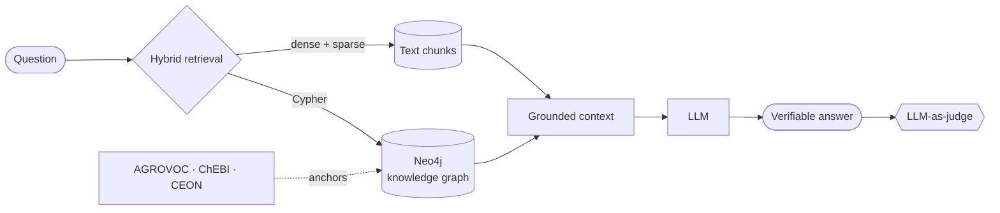

# Francesco Lazzarotto

**AI Research Fellow — University of Turin, Dept. of Computer Science**

Knowledge Graphs&nbsp;&nbsp;·&nbsp;&nbsp;Retrieval-Augmented Generation&nbsp;&nbsp;·&nbsp;&nbsp;LLM Evaluation

 

I work on getting language models to answer from **structured, verifiable knowledge** instead of parametric memory — grounding retrieval in knowledge graphs and domain ontologies, then measuring whether it actually helped.

Right now that means **GraphRAG applied to the circular economy for food**, part of the GaIA project at the University of Turin, in collaboration with the University of Gastronomic Sciences of Pollenzo.

 

## Currently

**Graph-grounded retrieval over food-security knowledge** — a Neo4j knowledge graph built from FAO and EU corpora, with an ongoing quality-repair cycle (structural metrics → Cypher/Python fixes → re-evaluation).

**Comparing knowledge-provision strategies** — plain-text baseline vs. locally materialized GraphRAG vs. vocabulary-anchored retrieval over AGROVOC, ChEBI and CEON. The question is not "does RAG work" but *which* form of structure pays for itself.

**LLM-as-judge evaluation harness** — a custom framework running Qwen3-30B-A3B and Qwen2.5-72B-Instruct on a multi-GPU vLLM cluster, used to score groundedness and answer quality at scale.

 

## What the pipeline looks like

Every claim in the answer should trace back to a node, an edge, or a source passage. That constraint is the whole point.

 

## Publications

**Balancing Thematic Relevance and Cognitive Load in Adaptive Text Recommendation for Learners with SLDs**
<!-- verifica l'ordine degli autori prima di pubblicare -->
G. Coucourde, F. Lazzarotto, F. Cena — **ACM UMAP 2026** · `accepted`

**Comparing Knowledge Provision Strategies for RAG in the Circular Food Domain**
<!-- sostituisci con il titolo esatto del paper ISWC -->
F. Lazzarotto et al. — **ISWC 2026 Workshop** · `under review`

**Ontology-Grounded Verifiable Question Answering in the Circular Food Domain**
M.Sc. thesis, University of Turin · [`read`](LINK-TESI)

 

## Selected work

| | |
|---|---|
| **[graphrag-ceff](LINK-REPO)** | End-to-end GraphRAG system for the circular food domain — retrieval strategies, KG construction, benchmarks, live demo. |
| **[kg-quality](LINK-REPO)** | Metrics and repair routines for knowledge-graph quality: structural diagnostics, Cypher-based fixes, before/after evaluation. |
| **[rag-eval](LINK-REPO)** | LLM-as-judge evaluation harness — rubric prompting, batched vLLM inference, agreement analysis. |

 

## Stack

**Core** &nbsp;

**Knowledge & data** &nbsp;

Also worked with

 

Keras · MySQL · PHP · Arduino · HTML/CSS/JS · Bootstrap · Figma — from earlier front-end and teaching work.

 

## Elsewhere

**Personal** — [francescolazzarotto01@gmail.com](mailto:francescolazzarotto01@gmail.com) &nbsp;·&nbsp; **Academic** — [francesco.lazzarotto@edu.unito.it](mailto:francesco.lazzarotto@edu.unito.it)

 

Off-hours: astronomy, robotics, and the mountains around Biella.

<!--
════════════════════════════════════════════════════════════════
BLOCCHI OPZIONALI — scommenta se ti servono
════════════════════════════════════════════════════════════════

1) CARD DELLE STATISTICHE GITHUB
   Sostituisci USERNAME. Sfondo trasparente: si adatta a tema chiaro e scuro.
   Nota: l'istanza pubblica va spesso in rate limit; se l'immagine si rompe
   spesso, fai il self-host su Vercel (fork di anuraghazra/github-readme-stats).

  

2) ORCID / GOOGLE SCHOLAR (consigliati per un profilo accademico)

════════════════════════════════════════════════════════════════
-->
